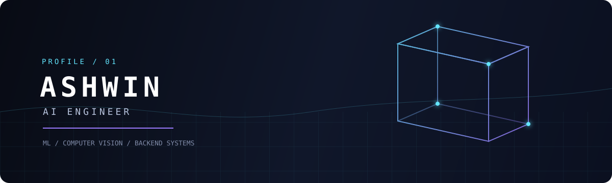

<div align="center">



<a href="https://github.com/Ashwin3207">GitHub</a> &nbsp;·&nbsp;
<a href="https://www.linkedin.com/in/ashwin-kumar-mathura">LinkedIn</a> &nbsp;·&nbsp;
<a href="mailto:amathura01@gmail.com">Email</a> &nbsp;·&nbsp;
<a href="https://leetcode.com/u/amathura01">LeetCode</a>

</div>

<br />

> I build software at the intersection of machine learning and backend engineering: models, APIs, and products that work together.

## System Map

<table>
<tr>
<td><strong>01 / Intelligence</strong><br />Python · Deep Learning · Computer Vision<br />LLMs · RAG · Scikit-learn · Pandas · NumPy</td>
<td><strong>02 / Product</strong><br />Java · Spring Boot · React<br />REST APIs · Node.js · Express</td>
<td><strong>03 / Infrastructure</strong><br />PostgreSQL · MongoDB · Redis<br />JWT · Docker · Git</td>
</tr>
</table>

## Featured Projects

### 01 / Parkinson's Detection

**Computer Vision · Deep Learning · Published Research**

```text
NewHandPD -> preprocessing -> EfficientNetB3 -> feature extraction -> Soft Voting -> prediction
```

An ensemble pipeline combining EfficientNetB3 deep features with Random Forest and Voting Classifier models, reaching 97% accuracy. Co-authored and presented at IEEE ISSS 2025.

### 02 / Campus2Corporate

**React · Node.js · MongoDB · AI**

```text
React -> REST API -> JWT / RBAC -> MongoDB -> AI assistant -> Ollama + RAG
```

Training and placement platform rebuilt as a MERN application, with role-based access, placement analytics, and a dual-LLM assistant using local Ollama with Gemini API fallback.

## Current Focus

AI engineering · ML / DL systems · Computer vision · LLM and RAG applications · Spring Boot services · React interfaces

## Education & Milestones

**B.Tech CSE (AI)**, Government Engineering College, Munger · **CGPA 8.7**
**GATE 2026 Qualified (CSE)** · **IEEE ISSS 2025 Published Author**

<div align="center">

<sub>Turning research ideas into useful software systems.</sub>

</div>
